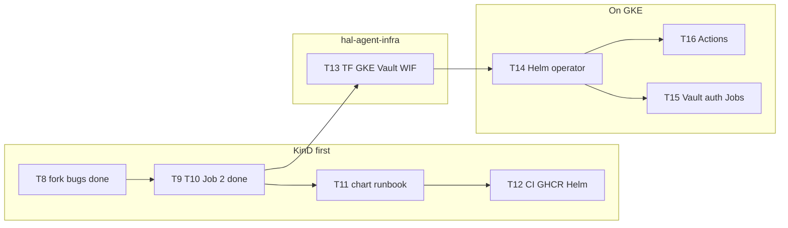
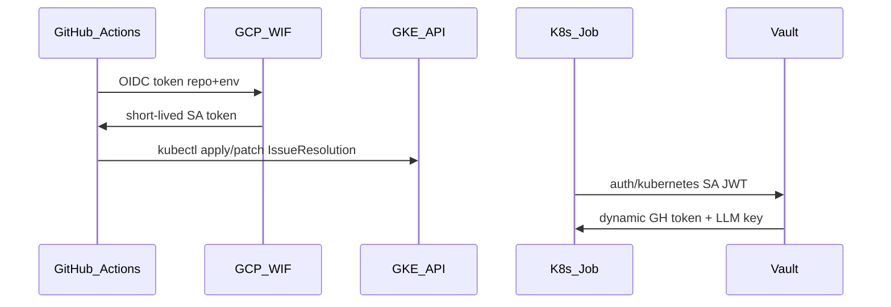

# LLM_PLAN — plan of record (resume here)

> **Single source of truth for progress.** Any agent/model resumes work from this
> file. Merges the triage POC plan (T0–T7, done) and the roadmap to an autonomous
> GKE agent (T8–T18).
>
> Read first: [`LLM_CONTEXT.md`](LLM_CONTEXT.md), [`AGENTS.md`](AGENTS.md),
> [`docs/operator-architecture.md`](docs/operator-architecture.md).
> Kubebuilder rule: never hand-edit generated files (`zz_generated.*`,
> `config/crd/bases/*`, `config/rbac/role.yaml`) — use `task manifests` /
> `task generate`.

## How to use this file (for agents)

1. Read the **Progress tracker** below; the first `[ ]` task is where to resume.
2. Do that task only, respecting its **Files / To do / Acceptance**.
3. Run the validation command; when acceptance is met, flip its `[ ]` → `[x]`,
   update the status column, and move the **Current position** pointer.
4. Never skip a `BLOCKING` task. Never edit generated files by hand.

**Current position:** `T11 — Chart + runbook for Job 2 (KinD)`

> Next operator work: T11 (KinD chart/runbook for Job 2). T9–T10 code may still
> be **uncommitted** in this repo — commit/review before relying on it. T16
> approval workflow landed in the `hal` fork; `create-cr` + env/E2E remain.

## Progress tracker

| Task | Status | Repo | Summary |
|---|---|---|---|
| T0 | [x] done | operator | Anthropic → Gemini migration |
| T1 | [x] done | operator | `readTriageResult`: only read succeeded pod |
| T2 | [x] done | operator | Technical error ≠ business rejection |
| T3 | [x] done | operator | Replace deprecated `Requeue: true` |
| T4 | [x] done | operator | Deduplicate default model ID |
| T5 | [x] done | operator | Missing tests (coverage ≥ 70%) |
| T6 | [x] done | operator | Verify Taskfile podman flow |
| T7 | [x] done | operator | End-to-end triage validation on KinD |
| T8 | [x] done | `test-hal-operator` fork | Fixture: 4 bugs + issues #5–#8 (**was BLOCKING**) |
| T9 | [x] done | operator | Controller phases Ready/Executing/PROpen/Failed |
| T10 | [x] done | operator | `cmd/fix` binary + separate fix image |
| T11 | [ ] todo | operator | Chart + runbook for Job 2 (KinD) |
| T12 | [ ] todo | operator | CI publish: image GHCR + Helm chart |
| T13 | [ ] todo | `hal-agent-infra` | TF GKE/Vault/WIF/RBAC + smoke WIF |
| T14 | [ ] todo | operator | Deploy operator on GKE |
| T15 | [ ] todo | infra + operator | Vault integration |
| T16 | [~] partial | `hal` fork | Approve workflow done; `create-cr` + env/E2E remain |
| T17 | [ ] todo | operator | Hardening & ops |
| T18 | [ ] todo | operator + infra | Docs (ROADMAP.md + infra README) |

## Context

Triage POC runs: `IssueResolution` CR → triage Job → Gemini → `status.triage`,
phase `PendingValidation`, then `spec.approved` → `Ready`. **Job 2 is wired in
code (T9–T10):** `Ready` → `Executing` → `PROpen` (retries via
`spec.maxFixAttempts`). Secrets for the POC = K8s Secret `gemini-api` (+ GitHub
PAT for fix Jobs until Vault at T15).

Target: issue GitHub → Action → CR on GKE → triage Job → `"agent go"` → fix Job
→ PR (human merge). Secrets via Vault. Passwordless auth GH↔GCP/GKE and
Jobs↔Vault (OIDC / Workload Identity Federation).

Command entry point: **`task`** (go-task, [`Taskfile.yml`](Taskfile.yml)). The
Makefile is the internal Kubebuilder engine — go through `task`.

Validation command after **every** task touching the operator:

```bash
task lint-fix && task test
```

Global criterion: `task test` green, no generated file hand-edited, no secret
written to any file.

## Repo split

- **`hal-k8s-operator`** (this repo) — operator product: Go, CRD, Helm chart,
  image, publish CI, KinD POC. **No `.tf` here.**
- **`hal-agent-infra`** (new, T13) — all IaC: Terraform GKE, Vault, GCP WIF, SA,
  cluster RBAC, smoke WIF.
- **Fixture repo** (`hashimiche/test-hal-operator`, T8) — injected bugs,
  RED tests, GitHub issues for Job 2 development (not the product `hal` tree).
- **Target / issues repo** (`hal` / fork `hashimiche/hal`) — business events:
  `issues.opened` + `"agent go"` workflows, CODEOWNERS, approval runbook (T16).

The operator **consumes** the cluster (Helm + values); the infra **provisions**
it. Terraform outputs (`cluster_name`, `wif_provider`, `vault_addr`, …) live in
`hal-agent-infra` and are referenced by workflows / Helm values.



Target state machine (`status.phase`):

```
Triage → PendingValidation → Ready → Executing → PROpen → Done
   |          (done)           |
   v                          v
Rejected                   Failed
```

---

# Done — triage POC (T0–T7)

> Validated end-to-end on KinD, 2026-07-19 (`task test` green, controller
> coverage 74.6%). Kept condensed for history; full narrative was in the
> original `GROK_PLAN.md`.

- **T0 — Anthropic → Gemini migration (was BLOCKING).** Replaced the Claude API
  call with Gemini (Google AI Studio key) in `cmd/triage/main.go`, controller,
  `cmd/main.go`, Helm chart. Env `GEMINI_API_KEY` / `GEMINI_MODEL`; default
  model in `internal/defaults/defaults.go`.
  *Hotfix 2026-07-19:* Google retired `gemini-2.5-flash` for new keys; default
  moved to the rolling alias `gemini-flash-latest`.
- **T1 — `readTriageResult`: only the succeeded pod.** Skip containers with
  `ExitCode != 0` so a failed attempt's termination-log is not read.
- **T2 — Technical error ≠ business rejection.** Added `parseError`; unreadable
  termination-log / unparsable JSON → `Failed` (not `Rejected`). `Rejected`
  stays for `Suspicious || !InScope` on a valid result.
- **T3 — Deprecated `Requeue`.** `ctrl.Result{Requeue: true}` →
  `RequeueAfter: time.Second` (controller-runtime v0.24).
- **T4 — Deduplicate default model ID.** `internal/defaults/defaults.go` is the
  single Go source of the model constant.
- **T5 — Missing tests.** `parseResult`, `truncateRunes`, envtest reject/fail
  paths, T1/T2 cases. `internal/controller` coverage ≥ 70%.
- **T6 — Taskfile podman flow.** `task kind-poc-cluster` / `kind-poc-image`
  verified on podman-only (WSL2).
- **T7 — End-to-end validation.** POC.md steps 1→5 on a clean KinD: CR → triage
  Job → Gemini analysis in logs → `status.triage.summary` filled →
  `PendingValidation`.

---

# Done — Job 2 foundation (T8–T10)

> Plan docs: [`docs/plans/T8-fixture-fork-bugs.md`](docs/plans/T8-fixture-fork-bugs.md),
> [`docs/plans/T9-T10-job2-fixer-architecture.md`](docs/plans/T9-T10-job2-fixer-architecture.md).

## T8 — Fixture: fork + inject bugs (done)

**Repo**: `hashimiche/test-hal-operator` (fixture fork; **not** the operator repo
and **not** the product `hal` tree). Plan lived in this operator repo.

**Landed**:

- Merged PR #4: test seams (`CheckContainer` / `CheckMultipass` package vars,
  `MariaDBEndpoint()`, `VaultAttachEndpoint()`).
- Branches `fixture/bug1`–`fixture/bug4` with injected bugs + RED tests.
- GitHub issues #5–#8 (symptom-only, `bug` label).
- No `bugfix/**` branches (Job 2 opens those).

**Acceptance met**: 4 reproducible bugs; `go test` red on each fixture branch;
issues created on the fork. Wiring Job 2 to clone base `fixture/bug<N>` (not
`main`) remains a T11 runbook item.

---

## T9 — Controller: Job 2 phases (done)

**Repo**: operator (`hal-k8s-operator`).

**Landed**:

- Stub `"POC stops after triage; Job 2 not wired"` removed.
- `Ready` → `Executing` → `PROpen` with retries via `spec.maxFixAttempts`.
- Helpers: `reconcileFix` / `handleFixFailure` / `buildFixJob` / `readFixResult`.
- `task test` passed (11/11 controller specs).

**Note**: implementation may still be **uncommitted** locally in the operator
repo — commit when ready; do not assume it is on remote `main`.

---

## T10 — `cmd/fix` binary (done)

**Repo**: operator (`hal-k8s-operator`).

**Landed**:

- `cmd/fix` pipeline: clone → `go test` → 2-phase Gemini → retest →
  commit/push → PR → termination-log.
- Separate fix image (`golang:1.26`); Helm/Taskfile wiring; shared
  `internal/gemini`.
- Distroless operator image keeps `/manager` + `/triage`; fix Job uses the
  Go toolchain image.

**Note**: same as T9 — code may be uncommitted locally. Full KinD E2E
(triage → approve → Job 2 → PR) is **T11**.

---

# Remaining — autonomous GKE agent (T11–T18)

## T11 — Chart + runbook for Job 2 (KinD) ← **resume here**

**Files**: [`charts/hal-k8s-operator/`](charts/hal-k8s-operator/),
[`POC.md`](POC.md), [`Taskfile.yml`](Taskfile.yml).

**Depends on**: T8 fixture + T9/T10 code (commit T9–T10 if still local-only).

**To do**:

- values for the Job 2 image/entrypoint, the GitHub Secret, `runtimeClassName`
  (empty by default) — extend whatever T10 already wired.
- Extend POC.md / Taskfile: full flow triage → `kubectl patch approved` →
  Job 2 → PR on `test-hal-operator`, cloning base `fixture/bug<N>`.
- Document per-bug test commands from the T8 fixture doc.

**Acceptance**: on KinD, manual CR → triage → approve → Job 2 → PR on the
fixture fork, following POC.md with no deviation.

---

## T12 — CI publish: image GHCR + Helm chart

**Repo**: operator. **Files**: `.github/workflows/*` (new; today lint/test/e2e
only).

**To do**:

| Workflow | Trigger | Output |
|---|---|---|
| Build & push image | tag `v*` / release | `ghcr.io/<org>/hal-k8s-operator:<tag>` |
| Package & push Helm | same | OCI chart `oci://ghcr.io/<org>/charts` |

- Also publish the **separate fix image** (T10) alongside the operator image.
- `permissions: packages: write` (+ `id-token` if needed); GHCR login.
- Chart version aligned to the tag; `appVersion` = image tag/digest.
- amd64 to start (multi-arch later).
- Document install `helm install … oci://…`.

**Acceptance**: a tag pushes image(s) + chart; `helm install` of a published
version works on a fresh cluster (KinD first).

---

## T13 — Repo `hal-agent-infra` (IaC + trust boundaries)

**Repo**: **`hal-agent-infra`** (new). Do **after** T11 validated locally
(avoid paying for GKE during the fix iteration). **All** Terraform lives here —
no `.tf` in `hal-k8s-operator`.

**To do**:

- Bootstrap: README (trust model, GCP/org prerequisites, consumed outputs),
  layout `modules/{gke,vault,wif}` + `envs/lab`, remote state (GCS), CI
  `terraform fmt/validate/plan` (manual apply / protected environment).
- Reuse / module-ize the GKE Terraform already present on the Hashicorp academy
  side (don't blindly duplicate).
- TF scope:
  1. **GCP WIF + SA** — GitHub OIDC pool/provider; condition
     `attribute.repository` (+ environment); SA with limited GKE rights.
  2. **GKE** — **Standard** cluster + node pool; Workload Identity; base
     network; namespace `hal-agent`.
  3. **Vault** — `kubernetes` auth; Job1/Job2 roles; engines / dynamic GitHub
     App or PAT + LLM; least-privilege policies.
  4. **K8s RBAC for the GHA runner** — namespaced Role/RoleBinding:
     `create/get/patch` on `issueresolutions` only; **no** verbs on `status`;
     no Secrets/Vault access.
  5. **Outputs** — `cluster_name`, `cluster_location`, `project_id`,
     `wif_provider`, `deployer_sa_email`, `vault_addr`, `hal_agent_namespace`.

Identity chain (no long-lived secret):



**Acceptance**: `terraform apply` OK; smoke `workflow_dispatch` (OIDC → WIF →
`kubectl get ns` / `kubectl get issueresolutions -n hal-agent`) succeeds
**without a JSON key**.

---

## T14 — Deploy the operator on GKE

**Repo**: operator, consuming `hal-agent-infra` outputs.

**To do**:

- `helm upgrade --install` (GHCR image / OCI chart from T12).
- Namespace `hal-agent` (created by TF or the chart); CRDs; controller RBAC.
- Secrets still K8s if Vault not ready (switch at T15).
- NetworkPolicy for Jobs: egress GitHub + LLM endpoint only (architecture §6) —
  manifests in the chart / overlay, no application TF.

**Acceptance**: KinD scenario replayed on GKE with a manual CR → triage →
approve → fix → PR.

---

## T15 — Vault (infra / operator split)

**To do**:

- **`hal-agent-infra`**: finalize Kubernetes auth, roles, policies, engines (if
  not already at T13).
- **`hal-k8s-operator`** (chart): **init-container** pattern Vault → shared
  volume; annotated Job SAs; remove/neutralize POC Secrets (`gemini-api`, PAT).
- Job 1: LLM key (+ issue-read token if GitHub comment/label enabled).
- Job 2: token `contents:write` + `pull_requests:write` + LLM.
- Controller: **never** a Vault/GitHub client (golden rule).

**Acceptance**: Jobs OK with no plaintext secret in Helm values; no secret in
the CR or controller logs.

---

## T16 — GitHub Actions (target repo) — **partial**

**Repo**: issues repo (`hashimiche/hal`), not the operator (architecture §2).
Plan: [`docs/plans/T16-github-k8s-approval-workflow.md`](docs/plans/T16-github-k8s-approval-workflow.md).
Base on [`config/samples/issueresolution.template.yaml`](config/samples/issueresolution.template.yaml).

### Done (approve volet)

- `.github/workflows/agent-approve.yml` + `docs/agent-approval-runbook.md` in the
  `hal` fork.
- Triggers: comment `agent go` or label `agent: go`; OIDC → WIF → GKE; patch
  `spec.approved` only (never `status.*`).

### Remaining

| Item | Notes |
|---|---|
| Manual env/vars | Protected env `hal-cluster`, GCP/GKE/`HAL_AGENT_NAMESPACE` vars, label `agent: go`, merge workflow to `main` |
| E2E smoke | CODEOWNER `agent go` → CR `spec.approved=true` on cluster (needs T13/T14 for real GKE) |
| **`create-cr` workflow** | Still **open** / separate deliverable: `issues.opened` → fill template → `kubectl apply` CR `issue-<n>` |

**Full acceptance** (when `create-cr` + infra are ready): open an issue on the
fork → CR on GKE → triage → `"agent go"` → Job 2 → PR; human merge only.

---

## T17 — Hardening & ops (post autonomous MVP)

**To do**:

- Monitoring: CR conditions, alerts on `Failed` Jobs, controller metrics.
- Quotas / `maxFixAttempts`, blacklist (`AgentPolicy` later).
- Incident runbooks: revoke Vault role / WIF SA (procedures in
  `hal-agent-infra`).
- Dashboard: **deferred** (primary gate = GitHub comment).

**Acceptance**: reproducible end-to-end on GKE + basic alerting in place.

---

## T18 — Docs

**To do**:

- [`ROADMAP.md`](ROADMAP.md) at the operator root = the T8–T18 view, linked from
  [`LLM_CONTEXT.md`](LLM_CONTEXT.md) and [`README.md`](README.md). *(This file,
  `LLM_PLAN.md`, is the live tracker; ROADMAP.md can be a stable public view.)*
- Mirror README in `hal-agent-infra` (outputs, trust model, smoke WIF).

**Acceptance**: a newcomer follows LLM_PLAN.md T11→T17 with no oral context.

---

## Out of scope (do not do)

- Auto-merge of PRs.
- Webhook receiver / ingress HMAC (decision 2026-07-20: replaced by GHA).
- Sysbox / Autopilot nested containers (not needed while `go test` is
  in-process).
- GitHub/Vault calls from the controller process.
- Terraform in `hal-k8s-operator` (reserved for `hal-agent-infra`).
- Secrets in CRs, committed Helm values, code or logs.
- Editing generated files listed in `AGENTS.md`.
