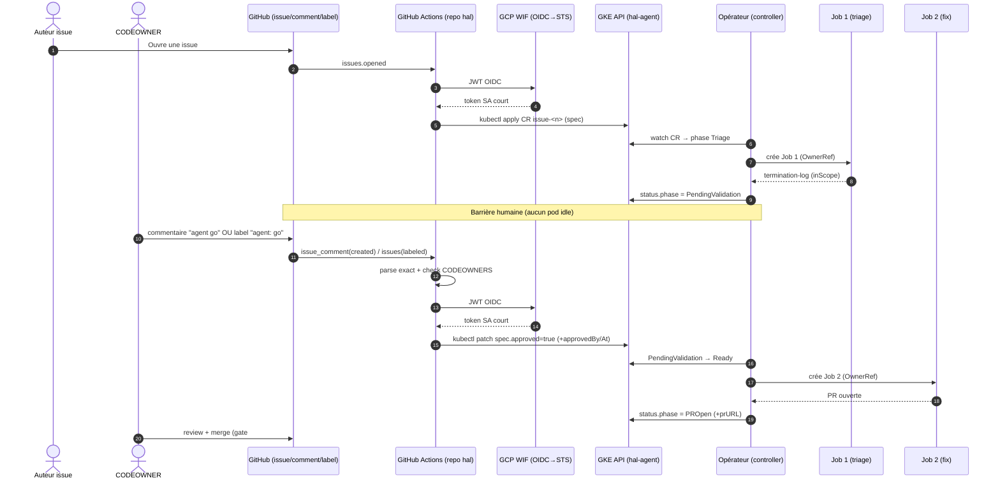

# Plan exécutable — Workflow d'approbation GitHub ↔ Kubernetes (T16, volet « agent go »)

> **Destinataire :** agent d'exécution (Grok). **Repo cible :** le fork `hal` (dépôt des issues), **pas** l'opérateur (cf. architecture §2).
> **Périmètre :** uniquement le volet **approbation** (le CODEOWNER donne le « go »). La création de CR sur `issues.opened` (`create-cr`) est mentionnée mais reste un livrable T16 séparé.
> **Contrainte absolue :** planning seulement ici. Aucun secret committé, aucune écriture dans `status.*`, aucun `.tf` dans ce repo.

---

## 0. Réponse directe à la question posée

**Oui**, une GitHub Action peut réagir aux deux gestes d'un CODEOWNER (commentaire ou label). Deux déclencheurs :

| Geste du CODEOWNER | Trigger GitHub Actions | Filtre |
|---|---|---|
| Commentaire dont le corps vaut exactement `agent go` | `issue_comment` (`types: [created]`) | corps == `agent go` + issue (pas PR) |
| Application du label (ex. `agent: go`) | `issues` (`types: [labeled]`) | `github.event.label.name` == nom retenu |

**Nuance de sécurité (à écrire dans le runbook) :** les workflows `issue_comment` et `issues` **s'exécutent toujours à partir du fichier de workflow présent sur la branche par défaut** du dépôt (pas depuis une PR/fork). Conséquences :
- Un contributeur ne peut pas modifier la logique d'approbation via une PR : seul ce qui est mergé sur `main` s'exécute. C'est un atout.
- Le `GITHUB_TOKEN` peut être en lecture/écriture ; il faut donc le **restreindre explicitement** avec un bloc `permissions:` minimal.
- L'événement porte des données **contrôlées par un tiers** (corps du commentaire, `author_association`). L'autorité ne doit **jamais** reposer sur ces champs seuls : c'est le contrôle **CODEOWNERS / permission repo** qui fait foi (architecture §6).

---

## 1. Rappels de contrat (issus du code, à ne pas ré-inventer)

Champs de spec réellement disponibles (source : `api/v1alpha1/issueresolution_types.go`) :

- `spec.approved` : `bool` (JSON `approved`, `omitempty`).
- `spec.approvedBy` : `string` (JSON `approvedBy`).
- `spec.approvedAt` : `*metav1.Time` (JSON `approvedAt`) → attend un **RFC3339** (ex. `2026-07-22T21:00:00Z`).

Identité de la ressource :
- **Group/Version/Kind :** `agent.hal.dev/v1alpha1`, `IssueResolution`.
- **Ressource (pluriel RBAC) :** `issueresolutions`.
- **Namespace :** `hal-agent`.
- **Nom (clé de dédup) :** `issue-<number>` avec `<number>` = `github.event.issue.number`.

Machine à états (`status.phase`), écrite **uniquement par l'opérateur** :
```
Triage → PendingValidation → Ready → Executing → PROpen → Done
  |                            |
  v                            v
Rejected                    Failed
```
Le workflow ne touche qu'à `spec`. Après `spec.approved=true`, c'est **l'opérateur** qui fait `PendingValidation → Ready` puis lance Job 2.

Sorties Terraform à consommer (produites par T13 dans `hal-agent-infra`) :
`wif_provider`, `deployer_sa_email`, `cluster_name`, `cluster_location`, `project_id`, `hal_agent_namespace`.
→ À stocker comme **variables de dépôt/environnement** (non secrètes : ce ne sont pas des credentials) : `GCP_WIF_PROVIDER`, `GCP_DEPLOYER_SA`, `GKE_CLUSTER_NAME`, `GKE_CLUSTER_LOCATION`, `GCP_PROJECT_ID`, `HAL_AGENT_NAMESPACE`.

---

## 2. Chaîne d'identité sans secret long (OIDC → WIF → GKE)

Ordre exact des steps (identique pour comment et label, à factoriser) :

1. `permissions: { id-token: write }` → autorise GitHub à émettre un **JWT OIDC**.
2. `google-github-actions/auth@v2` avec :
   - `workload_identity_provider: ${{ vars.GCP_WIF_PROVIDER }}` (= sortie TF `wif_provider`)
   - `service_account: ${{ vars.GCP_DEPLOYER_SA }}` (= sortie TF `deployer_sa_email`)
   → échange le JWT OIDC contre un **token SA court** (STS), aucun JSON key.
3. `google-github-actions/get-gke-credentials@v2` avec :
   - `cluster_name: ${{ vars.GKE_CLUSTER_NAME }}`
   - `location: ${{ vars.GKE_CLUSTER_LOCATION }}`
   - `project_id: ${{ vars.GCP_PROJECT_ID }}`
   → écrit un `kubeconfig` utilisant le plugin `gke-gcloud-auth-plugin` (token éphémère).
4. `kubectl` s'exécute avec ce kubeconfig ; le SA GCP est mappé côté cluster à un sujet RBAC restreint (Role/RoleBinding dans `hal-agent`, cf. §4).

**Condition WIF (posée en TF, à vérifier, pas à coder ici) :** l'attribut `attribute.repository` doit être épinglé sur `owner/hal` **et** idéalement sur l'`environment` protégé (§6). Le smoke test T13 (`workflow_dispatch` → `kubectl get issueresolutions -n hal-agent`) doit être vert avant ce workflow.

---

## 3. La mutation exacte du cluster (`kubectl patch`)

**Golden rule :** merge-patch sur la ressource → ne touche **jamais** le sous-ressource `status` (aucun `--subresource=status`). Le RBAC (§4) interdit d'ailleurs `status`.

Payload (merge patch) :
```json
{"spec":{"approved":true,"approvedBy":"<login>","approvedAt":"<rfc3339>"}}
```

Commande (idempotente : merge sur un objet nommé `issue-<n>`) :
```bash
NUM="${{ github.event.issue.number }}"
NS="${{ vars.HAL_AGENT_NAMESPACE }}"   # "hal-agent"
APPROVER="<login validé>"
NOW="$(date -u +%Y-%m-%dT%H:%M:%SZ)"

kubectl -n "$NS" patch issueresolution "issue-${NUM}" \
  --type merge \
  -p "{\"spec\":{\"approved\":true,\"approvedBy\":\"${APPROVER}\",\"approvedAt\":\"${NOW}\"}}"
```

**Garde-fous avant patch** (voir cas limites §7) :
```bash
# 1) La CR doit exister
if ! kubectl -n "$NS" get issueresolution "issue-${NUM}" >/dev/null 2>&1; then
  echo "::error::CR issue-${NUM} introuvable"; POST_COMMENT="CR not found"; exit 1
fi
# 2) Doit être en PendingValidation (sinon approbation prématurée / hors phase)
PHASE="$(kubectl -n "$NS" get issueresolution "issue-${NUM}" -o jsonpath='{.status.phase}')"
if [ "$PHASE" != "PendingValidation" ]; then
  echo "::warning::Phase=$PHASE (attendu PendingValidation)"; # cf. décision ouverte D5
fi
# 3) Déjà approuvée ? no-op idempotent
ALREADY="$(kubectl -n "$NS" get issueresolution "issue-${NUM}" -o jsonpath='{.spec.approved}')"
if [ "$ALREADY" = "true" ]; then echo "Already approved, no-op"; exit 0; fi
```

---

## 4. RBAC côté cluster (à provisionner en TF — T13 item 4 — rappelé ici pour cohérence)

Le runner (SA GCP mappé) doit pouvoir **patcher la spec mais jamais le status** :

```yaml
apiVersion: rbac.authorization.k8s.io/v1
kind: Role
metadata:
  name: gha-approver
  namespace: hal-agent
rules:
  - apiGroups: ["agent.hal.dev"]
    resources: ["issueresolutions"]
    verbs: ["get", "patch", "create"]   # create requis pour le workflow create-cr (T16)
  # PAS de règle sur issueresolutions/status → écriture status impossible
  # PAS de secrets, pods, list cluster-wide, etc.
```
+ `RoleBinding` liant ce `Role` au sujet correspondant au `deployer_sa_email` (via Workload Identity / mapping IAM→RBAC défini en TF). **Aucune** permission hors `hal-agent`.

> Note technique confirmant la sûreté : un `kubectl patch` sans `--subresource=status` sur un CRD ayant `subresource:status` **ne modifie pas** le status ; combiné à l'absence de verbe sur `issueresolutions/status`, l'écriture de `status.*` est doublement impossible.

---

## 5. Les deux événements + squelettes YAML

Deux options d'implémentation :
- **(Recommandé) Un seul fichier** `agent-approve.yml` avec les deux triggers et une normalisation `NUM`/`ACTOR` en tête de job.
- (Alternative) Deux fichiers séparés `approve-comment.yml` / `approve-label.yml` appelant un **composite action** local `.github/actions/approve-cr` (DRY). À retenir si on veut des `permissions`/environnements différents par événement.

### 5.1 Trigger commentaire — parsing exact
```yaml
on:
  issue_comment:
    types: [created]
```
Filtres (dans `if:` du job) :
- **Exclure les PR :** `github.event.issue.pull_request == null` (les commentaires de PR arrivent aussi via `issue_comment`).
- **Corps exact :** normaliser puis comparer. Décision D2 (casse/espaces) ci-dessous ; proposition robuste :
```bash
# via env:
#   COMMENT_BODY: ${{ github.event.comment.body }}
norm="$(printf '%s' "$COMMENT_BODY" | tr -d '\r' | sed -e 's/^[[:space:]]*//' -e 's/[[:space:]]*$//')"
if [ "$norm" != "agent go" ]; then echo "Commentaire non déclencheur"; exit 0; fi
ACTOR="${{ github.event.comment.user.login }}"
```
> **Sécurité d'injection :** ne jamais interpoler `github.event.comment.body` directement dans une ligne shell. Toujours passer par `env:` puis lire `$COMMENT_BODY`.

### 5.2 Trigger label
```yaml
on:
  issues:
    types: [labeled]
```
Filtres :
```bash
# via if: du job → github.event.label.name == 'agent: go'
ACTOR="${{ github.event.sender.login }}"   # celui qui a posé le label
```
On ne réagit **qu'à** `labeled`. On ne s'abonne **pas** à `unlabeled` (retirer le label ne dé-approuve pas — cf. §7).

---

## 6. Autorisation : l'acteur est-il un approbateur légitime ?

Objectif : rejeter tout acteur non-CODEOWNER. Trois mécanismes possibles, du plus proche de la demande au plus simple. **Recommandation : combiner (A) CODEOWNERS et (C) permission repo** en défense en profondeur ; (B) si on préfère une équipe.

### (A) Parsing de `CODEOWNERS` (répond littéralement à « CODEOWNER »)
Emplacements possibles : `.github/CODEOWNERS`, `CODEOWNERS`, `docs/CODEOWNERS`.
```bash
CO_FILE=""
for p in .github/CODEOWNERS CODEOWNERS docs/CODEOWNERS; do
  [ -f "$p" ] && CO_FILE="$p" && break
done
[ -z "$CO_FILE" ] && { echo "::error::CODEOWNERS absent"; exit 1; }

# Récupère les propriétaires du motif global "*" (approbateurs "repo-wide").
# Format ligne: "<pattern> @user @org/team ..."
OWNERS="$(grep -E '^\*[[:space:]]' "$CO_FILE" | sed -E 's/#.*$//' | awk '{$1=""; print}')"
# Sépare users (@login) et teams (@org/team)
```
- Pour un `@login` : autorisé si `ACTOR` == `login`.
- Pour un `@org/team` : résoudre l'appartenance via `gh api`:
```bash
gh api "orgs/<org>/teams/<team>/memberships/${ACTOR}" --jq '.state' 2>/dev/null | grep -q active
```
> Le fichier CODEOWNERS est checkout via `actions/checkout` (branche par défaut). `author_association` de l'event **ne suffit pas** (architecture §6) : il n'est qu'un signal complémentaire, jamais l'autorité.

### (B) Appartenance à une équipe/org dédiée (plus maintenable)
Définir une équipe (ex. `@<org>/hal-agent-approvers`) et vérifier :
```bash
gh api "orgs/<org>/teams/hal-agent-approvers/memberships/${ACTOR}" --jq '.state'
```

### (C) Permission sur le repo (garde-fou simple et fiable)
```bash
PERM="$(gh api "repos/${{ github.repository }}/collaborators/${ACTOR}/permission" --jq '.permission')"
case "$PERM" in admin|maintain|write) : ;; *) echo "::error::acteur non autorisé"; exit 1;; esac
```

**En cas de rejet :** poster un commentaire d'issue explicite et échouer le job.
```bash
gh issue comment "$NUM" --repo "${{ github.repository }}" \
  --body "@${ACTOR} n'est pas autorisé à approuver (CODEOWNERS/permission requis). Aucune action effectuée."
exit 1
```
> `gh` utilise `GITHUB_TOKEN` (permissions `issues: write`, `contents: read`) — pas de secret dédié.

---

## 7. Cas limites (comportement attendu)

| Cas | Détection | Comportement |
|---|---|---|
| Commentaire ≠ `agent go` (typo, phrase, casse) | normalisation §5.1 | `exit 0` silencieux (no-op), aucun patch |
| Commentaire sur une **PR** (pas une issue) | `github.event.issue.pull_request != null` | ignorer |
| **Label retiré** (`unlabeled`) | non abonné à ce type | aucun effet ; l'approbation n'est **pas** annulée (l'opérateur ne revient pas de `Ready`) |
| Acteur **non-CODEOWNER** | §6 | commentaire de refus + `exit 1` (échec visible) |
| **CR introuvable** (`issue-<n>`) | garde §3.1 | commentaire « CR pas encore créée, réessayez après triage » + `exit 1` |
| CR **pas encore en `PendingValidation`** (Triage en cours, Rejected, Failed…) | garde §3.2 | par défaut `::warning::` + refus de patch (décision D5) ; commenter la phase courante |
| CR **déjà approuvée** | garde §3.3 | no-op idempotent `exit 0` |
| Double événement (comment **et** label) | idempotence merge + garde `already approved` | second run = no-op |

---

## 8. Séquence end-to-end



---

## 9. Idempotence, environnement protégé, règle d'or

- **Idempotence :** clé = `metadata.name = issue-<number>`. Le merge-patch est rejouable ; garde `already approved` (§3.3) rend les événements en double inoffensifs.
- **Environnement protégé :** exécuter le job d'approbation dans un `environment:` GitHub (ex. `hal-cluster`) avec, si souhaité, required reviewers/branch restrictions. La **condition WIF** doit inclure cet `environment` (posé en TF) → seul ce workflow, sur `main`, dans cet environnement, peut obtenir un token GCP.
- **Règle d'or :** le workflow n'écrit **que** `spec.*`, jamais `status.*` (garanti par le patch sans `--subresource=status` **et** par le RBAC §4). **Aucun secret** committé : que des `vars` non secrètes + OIDC. Le `GITHUB_TOKEN` est restreint par `permissions:`.

---

## 10. Fichiers à créer sur le repo cible (`hal` fork) + jobs

### Arborescence
```
.github/
  CODEOWNERS                     # définit les approbateurs (@user et/ou @org/team)
  workflows/
    agent-approve.yml            # CE livrable (comment + label)
    create-cr.yml                # T16 séparé (issues.opened) — hors périmètre ici
  actions/
    approve-cr/action.yml        # (optionnel) composite: auth GCP + patch, réutilisable
```

### `agent-approve.yml` — squelette complet
```yaml
name: agent-approve

on:
  issue_comment:
    types: [created]
  issues:
    types: [labeled]

permissions:
  contents: read      # checkout CODEOWNERS
  id-token: write     # OIDC → WIF
  issues: write       # commentaires de feedback/refus

concurrency:
  group: agent-approve-${{ github.event.issue.number }}
  cancel-in-progress: false

jobs:
  approve:
    runs-on: ubuntu-latest
    environment: hal-cluster   # environnement protégé (décision D3)
    # Pré-filtre grossier au niveau job (le parsing fin est dans les steps)
    if: >-
      ( github.event_name == 'issue_comment'
        && github.event.issue.pull_request == null )
      || ( github.event_name == 'issues'
        && github.event.action == 'labeled' )
    steps:
      - name: Checkout (CODEOWNERS)
        uses: actions/checkout@v4

      - name: Determine trigger, actor and number
        id: ctx
        env:
          COMMENT_BODY: ${{ github.event.comment.body }}
          LABEL_NAME: ${{ github.event.label.name }}
          APPROVE_LABEL: "agent: go"   # décision D1
        run: |
          set -euo pipefail
          NUM="${{ github.event.issue.number }}"
          if [ "${{ github.event_name }}" = "issue_comment" ]; then
            norm="$(printf '%s' "$COMMENT_BODY" | tr -d '\r' \
              | sed -e 's/^[[:space:]]*//' -e 's/[[:space:]]*$//')"
            [ "$norm" = "agent go" ] || { echo "match=false" >>"$GITHUB_OUTPUT"; exit 0; }
            ACTOR="${{ github.event.comment.user.login }}"
          else
            [ "$LABEL_NAME" = "$APPROVE_LABEL" ] || { echo "match=false" >>"$GITHUB_OUTPUT"; exit 0; }
            ACTOR="${{ github.event.sender.login }}"
          fi
          echo "match=true" >>"$GITHUB_OUTPUT"
          echo "num=$NUM"   >>"$GITHUB_OUTPUT"
          echo "actor=$ACTOR">>"$GITHUB_OUTPUT"

      - name: Authorize actor (CODEOWNERS + repo permission)
        if: steps.ctx.outputs.match == 'true'
        env:
          GH_TOKEN: ${{ github.token }}
          ACTOR: ${{ steps.ctx.outputs.actor }}
          NUM: ${{ steps.ctx.outputs.num }}
        run: |
          set -euo pipefail
          # (A) CODEOWNERS (B) team (C) permission — cf. §6, échec => commentaire + exit 1
          # ... implémentation §6 ...

      - name: GCP auth via OIDC/WIF
        if: steps.ctx.outputs.match == 'true'
        uses: google-github-actions/auth@v2
        with:
          workload_identity_provider: ${{ vars.GCP_WIF_PROVIDER }}
          service_account: ${{ vars.GCP_DEPLOYER_SA }}

      - name: Get GKE credentials
        if: steps.ctx.outputs.match == 'true'
        uses: google-github-actions/get-gke-credentials@v2
        with:
          cluster_name: ${{ vars.GKE_CLUSTER_NAME }}
          location: ${{ vars.GKE_CLUSTER_LOCATION }}
          project_id: ${{ vars.GCP_PROJECT_ID }}

      - name: Patch spec.approved=true (guards + idempotence)
        if: steps.ctx.outputs.match == 'true'
        env:
          NS: ${{ vars.HAL_AGENT_NAMESPACE }}
          NUM: ${{ steps.ctx.outputs.num }}
          APPROVER: ${{ steps.ctx.outputs.actor }}
          GH_TOKEN: ${{ github.token }}
        run: |
          set -euo pipefail
          # gardes §3 (exist / phase / already approved) puis:
          NOW="$(date -u +%Y-%m-%dT%H:%M:%SZ)"
          kubectl -n "$NS" patch issueresolution "issue-${NUM}" --type merge \
            -p "{\"spec\":{\"approved\":true,\"approvedBy\":\"${APPROVER}\",\"approvedAt\":\"${NOW}\"}}"
          gh issue comment "$NUM" --repo "${{ github.repository }}" \
            --body "Approbation enregistrée par @${APPROVER}. L'agent va lancer le fix."
```

### Jobs, étape par étape (résumé exécutable)
1. **Pré-filtre `if`** : bon event + issue (pas PR) / action `labeled`.
2. **Checkout** : pour lire `CODEOWNERS`.
3. **Contexte** : détecter comment vs label, extraire `NUM` et `ACTOR`, matcher `agent go` / label. No-op si pas de match.
4. **Autorisation** (§6) : CODEOWNERS (+ team + permission). Rejet → commentaire + `exit 1`.
5. **Auth GCP** (OIDC→WIF) puis **credentials GKE**.
6. **Patch** (§3) avec gardes exist/phase/already-approved, puis commentaire de confirmation.

---

## 11. Décisions ouvertes (à trancher par l'utilisateur avant implémentation)

- **D1 — Nom exact du label.** Proposé : `agent: go`. Alternatives : `agent:go`, `agent/go`, `approved`. (Le label doit être pré-créé dans le repo.)
- **D2 — Sensibilité du commentaire.** « exact `agent go` » : accepte-t-on trailing/leading whitespace (proposé : oui) et la casse (proposé : sensible → `Agent Go` refusé) ? Autorise-t-on un préfixe `/agent go` (style slash-command) ?
- **D3 — Méthode d'autorité.** CODEOWNERS (littéral) vs équipe dédiée `@org/hal-agent-approvers` vs simple permission repo. Recommandé : CODEOWNERS **+** permission (défense en profondeur).
- **D4 — Nom de l'`environment` protégé** (proposé `hal-cluster`) et required reviewers éventuels ; doit matcher la condition WIF posée en T13.
- **D5 — Politique hors-phase.** Si la CR n'est pas `PendingValidation` (ex. `Triage`) au moment du « go » : refuser (proposé) ou ré-essayer/attendre ?
- **D6 — Un fichier vs deux + composite action** (`.github/actions/approve-cr`). Recommandé : un seul `agent-approve.yml` sauf besoin de permissions distinctes par event.
- **D7 — `vars` vs `secrets`** pour les sorties TF : proposé `vars` (non sensibles). À confirmer avec la politique org.

---

### Pré-requis / dépendances
- **T13** appliqué : cluster GKE, WIF provider + SA, RBAC `gha-approver` (§4), namespace `hal-agent`, smoke WIF vert.
- **T16 `create-cr`** opérationnel (sinon `issue-<n>` n'existe pas → cas « CR introuvable »).
- `CODEOWNERS` présent sur `main` avec au moins un `*` owner.
- Variables `GCP_*` / `GKE_*` / `HAL_AGENT_NAMESPACE` renseignées au niveau repo/environnement.

**Critère d'acceptation (extrait T16) :** sur le fork, un CODEOWNER poste `agent go` (ou pose le label) → la CR `issue-<n>` passe à `spec.approved=true` (+ `approvedBy`/`approvedAt`) sans secret long, l'opérateur enchaîne `Ready → Job 2 → PROpen`, merge humain uniquement. Un non-CODEOWNER est rejeté sans mutation.
