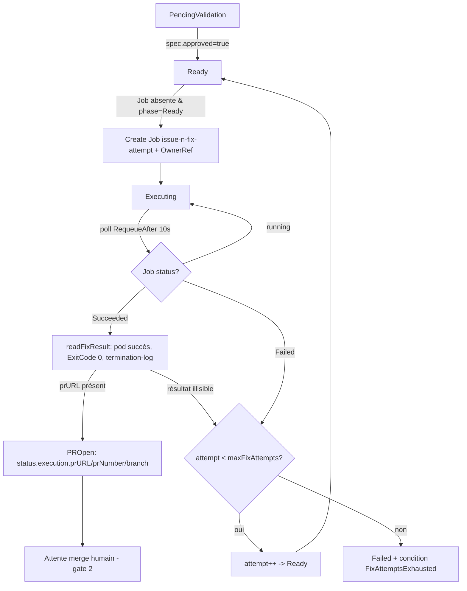

# Plan exécutable — T9 (contrôleur : phases Job 2) & T10 (`cmd/fix`)

> Destiné à un agent d'exécution (Grok). **Planning uniquement, ne pas coder ici.**
> Toute affirmation ci-dessous est ancrée dans le code réel lu (chemins cités).
> Règle Kubebuilder : ne jamais éditer à la main les fichiers générés ; passer par `task manifests` / `task generate` (cf. `AGENTS.md`, `LLM_PLAN.md` l.7-11).
> Commande de validation après chaque étape touchant l'opérateur : `task lint-fix && task test` (`LLM_PLAN.md` l.61-64).

---

## 0. État actuel du code (ancrage)

- Le `switch phase` du reconciler route déjà chaque phase. Les phases Job 2 sont un **stub** à retirer :

```go
	case agentv1alpha1.PhaseReady, agentv1alpha1.PhaseExecuting,
		agentv1alpha1.PhasePROpen, agentv1alpha1.PhaseDone:
		ir.Status.Message = "POC stops after triage; Job 2 not wired"
		result = ctrl.Result{}
```
(`internal/controller/issueresolution_controller.go` l.111-114)

- `reconcileTriage` (`issueresolution_controller.go` l.135-241) est le **patron structurel** à calquer : Get Job par nom → `NotFound` ⇒ build+create+condition+requeue ; `Succeeded>0` ⇒ lire le termination-log → transition ; `Failed>0` ⇒ `PhaseFailed`+condition ; sinon "running" + requeue.
- `buildTriageJob` (l.260-334) construit la Job : labels `hal.dev/issueresolution` + `hal.dev/job-role`, `RestartPolicy: Never`, `SecurityContext` durci (runAsNonRoot, drop ALL, readOnlyRootFilesystem), env dont `GEMINI_API_KEY` via `SecretKeyRef`, puis `controllerutil.SetControllerReference(ir, job, r.Scheme)` (l.330).
- `readTriageResult` (l.336-374) : liste les pods par labels **dont `batch.kubernetes.io/controller-uid`** (l.52 + 343), **saute `ExitCode != 0`** (patron T1, l.356-358), `json.Unmarshal` du `Terminated.Message`.
- `triageJobName` = `fmt.Sprintf("%s-triage", ir.Name)` (l.376-378) ; `ir.Name` vaut `issue-<n>`.
- Écriture du statut : `r.Status().Patch(ctx, &ir, client.MergeFrom(orig))` en fin de `Reconcile` (l.127).
- `reconcilePendingValidation` (l.243-258) fait déjà `spec.approved` ⇒ `PhaseReady` puis `ctrl.Result{}` (sans requeue). **À corriger** (voir §A.2).
- RBAC déjà en place (markers l.79-83) : `batch/jobs` (get;list;watch;create;update;patch;delete) et `core/pods` (get;list;watch). `Owns(&batchv1.Job{})` déjà câblé (l.421).
- CRD : `spec.maxFixAttempts *int32` défaut `2`, min 1 max 10 (`api/v1alpha1/issueresolution_types.go` l.107-113) — **jamais lu aujourd'hui**. `status.execution` a déjà `Attempt/JobName/Branch/PRURL/PRNumber` (l.152-173). Constantes de conditions `ConditionExecuting/ConditionPROpen/ConditionReady/ConditionFailed` déjà présentes (l.40-47).
- `Dockerfile` compile `/manager` + `/triage` dans un builder `golang:1.26`, image finale `gcr.io/distroless/static:nonroot` (l.13-22).
- `cmd/triage/main.go` : patron client Gemini réutilisable (`callGemini`, l.171-200), écriture `/dev/termination-log` (`writeTermination`, l.228-241), `truncateRunes` (l.250-256).
- `go.mod` : `google.golang.org/genai v1.64.0` présent ; **ni go-git ni go-github** ne sont encore là ; `golang.org/x/oauth2` est en indirect.
- Chart : `deployment.yaml` passe déjà `--triage-image`, `--gemini-secret-*`, `--gemini-model` (l.34-37) ; `secret.yaml` crée le Secret `gemini-api` ; `rbac.yaml` (ClusterRole) couvre jobs+pods.

---

## ⚠️ Décision ouverte n°1 — BLOQUANTE pour T10 : image du Job 2

Le binaire `/fix` doit exécuter **`go test`** sur le repo cible ⇒ il lui faut la **toolchain Go**. Or `gcr.io/distroless/static:nonroot` (Dockerfile l.16) **ne contient ni Go ni git**. Conséquence :

- `/manager` et `/triage` restent dans l'image distroless actuelle (rien de neuf requis côté runtime).
- `/fix` **ne peut pas** tourner dans cette image. **Recommandation** : produire une **image `fix` séparée** basée sur `golang:1.26` (Go + git présents), tirée par le contrôleur via un flag `--fix-image`. `go-git` couvre le clone/commit/push **en process** (pas besoin du binaire `git`), mais `go test` exige quand même le compilateur.
- Alternative : base `cgr.dev/chainguard/go` (non-root, toolchain incluse). À trancher par l'utilisateur.

**Le prompt demande de « vérifier que l'image distroless build toujours »** : interprétation retenue = après ajout de la compilation `/fix` dans le stage builder, l'image distroless (`/manager`+`/triage`) doit continuer à builder ; `/fix` part dans un **stage/target final distinct**. À confirmer.

Autres décisions ouvertes (récap en fin de document) : périmètre mono-fichier vs multi-fichiers ; nommage de branche ; retries LLM internes au Job vs pilotés par le contrôleur.

---

# Partie A — Contrôleur (T9)

Fichier unique : `internal/controller/issueresolution_controller.go` (retirer le stub l.111-114 et le remplacer par l'appel à `reconcileFix`).

## A.1 Routage du `switch`

```go
	case agentv1alpha1.PhaseReady, agentv1alpha1.PhaseExecuting, agentv1alpha1.PhasePROpen:
		result, err = r.reconcileFix(ctx, &ir)
	case agentv1alpha1.PhaseDone:
		result = ctrl.Result{} // terminal, no-op
```

Garder `PhaseRejected/PhaseFailed` en no-op (déjà l.115-116). Une **seule fonction `reconcileFix`** pilote tout le cycle Ready→Executing→PROpen, exactement comme `reconcileTriage` pilote tout le cycle Triage (création → succès/échec/running dans une seule fonction).

## A.2 Correctif de transition PendingValidation → Ready

Dans `reconcilePendingValidation` (l.248-249), après `ir.Status.Phase = PhaseReady`, renvoyer `ctrl.Result{RequeueAfter: time.Second}` (au lieu de `ctrl.Result{}`) pour enchaîner déterministiquement sur `reconcileFix`. (En envtest, `Reconcile` est appelé manuellement plusieurs fois, donc ceci sert surtout la robustesse en cluster réel.)

## A.3 Constantes & types à ajouter (en tête de fichier)

```go
const (
	jobRoleFix            = "fix"
	defaultMaxFixAttempts = int32(2) // fallback si spec.MaxFixAttempts == nil
)

// Miroir de triageJobResult (l.71-77) : ce que /fix écrit dans le termination-log.
type fixJobResult struct {
	PRURL    string `json:"prURL"`
	PRNumber int32  `json:"prNumber"`
	Branch   string `json:"branch"`
	Attempt  int32  `json:"attempt"`
	Error    string `json:"error,omitempty"`
}
```

## A.4 `reconcileFix` — logique (calquée sur `reconcileTriage`)

Pseudo-structure (≈200 lignes attendues) :

```go
func (r *IssueResolutionReconciler) reconcileFix(ctx context.Context, ir *agentv1alpha1.IssueResolution) (ctrl.Result, error) {
	// 0. Terminal : PR déjà ouverte → ne rien relancer (idempotence forte).
	if ir.Status.Phase == agentv1alpha1.PhasePROpen {
		return ctrl.Result{}, nil
	}

	// 1. Numéro de tentative courant (1-based). status.execution.Attempt fait foi.
	attempt := ir.Status.Execution.Attempt
	if attempt == 0 {
		attempt = 1
	}
	maxAttempts := defaultMaxFixAttempts
	if ir.Spec.MaxFixAttempts != nil {
		maxAttempts = *ir.Spec.MaxFixAttempts
	}
	jobName := fixJobName(ir, attempt)     // "issue-<n>-fix-<attempt>"
	branch := fixBranchName(ir, attempt)   // branche déterministe (cf. décision n°3)

	// 2. Get de la Job par nom.
	var job batchv1.Job
	err := r.Get(ctx, client.ObjectKey{Namespace: ir.Namespace, Name: jobName}, &job)

	if apierrors.IsNotFound(err) {
		// On ne CRÉE une Job que depuis la phase Ready (garde-fou anti-recréation
		// après nettoyage TTL d'une Job déjà terminée).
		if ir.Status.Phase != agentv1alpha1.PhaseReady && ir.Status.Execution.JobName != "" {
			return ctrl.Result{}, nil
		}
		newJob, buildErr := r.buildFixJob(ir, attempt, branch)
		if buildErr != nil { return ctrl.Result{}, buildErr }
		if createErr := r.Create(ctx, newJob); createErr != nil { return ctrl.Result{}, createErr }

		ir.Status.Phase = agentv1alpha1.PhaseExecuting
		ir.Status.Execution.Attempt = attempt
		ir.Status.Execution.JobName = jobName
		ir.Status.Execution.Branch = branch
		ir.Status.Message = fmt.Sprintf("Fix Job %s created (attempt %d/%d)", jobName, attempt, maxAttempts)
		meta.SetStatusCondition(&ir.Status.Conditions, metav1.Condition{
			Type: agentv1alpha1.ConditionExecuting, Status: metav1.ConditionTrue,
			Reason: "JobCreated", Message: ir.Status.Message, ObservedGeneration: ir.Generation,
		})
		return ctrl.Result{RequeueAfter: jobPollRequeue}, nil
	}
	if err != nil { return ctrl.Result{}, err }

	// 3. Job terminée avec succès → lire le résultat → PROpen.
	if job.Status.Succeeded > 0 {
		fr, termErr := r.readFixResult(ctx, ir, &job) // miroir de readTriageResult
		if termErr != nil || fr.PRURL == "" {
			// Job "succeeded" mais résultat illisible/incomplet : traiter comme échec technique.
			return r.handleFixFailure(ir, attempt, maxAttempts,
				fmt.Sprintf("Fix Job succeeded but result unreadable: %v", termErr))
		}
		ir.Status.Phase = agentv1alpha1.PhasePROpen
		ir.Status.Execution = agentv1alpha1.ExecutionStatus{
			Attempt: attempt, JobName: jobName, Branch: fr.Branch,
			PRURL: fr.PRURL, PRNumber: fr.PRNumber,
		}
		ir.Status.Message = fmt.Sprintf("PR opened: %s", fr.PRURL)
		meta.SetStatusCondition(&ir.Status.Conditions, metav1.Condition{
			Type: agentv1alpha1.ConditionPROpen, Status: metav1.ConditionTrue,
			Reason: "PROpened", Message: fr.PRURL, ObservedGeneration: ir.Generation,
		})
		return ctrl.Result{}, nil // terminal (merge = geste humain, gate #2)
	}

	// 4. Job échouée → retry piloté par maxFixAttempts.
	if job.Status.Failed > 0 {
		return r.handleFixFailure(ir, attempt, maxAttempts,
			fmt.Sprintf("Fix Job %s failed", jobName))
	}

	// 5. Sinon : en cours.
	ir.Status.Phase = agentv1alpha1.PhaseExecuting
	ir.Status.Message = fmt.Sprintf("Fix Job %s running… (attempt %d/%d)", jobName, attempt, maxAttempts)
	return ctrl.Result{RequeueAfter: jobPollRequeue}, nil
}
```

`handleFixFailure` (logique des retries, cœur de `spec.maxFixAttempts`) :

```go
func (r *IssueResolutionReconciler) handleFixFailure(ir *..., attempt, maxAttempts int32, msg string) (ctrl.Result, error) {
	if attempt < maxAttempts {
		ir.Status.Execution.Attempt = attempt + 1 // la prochaine réconciliation créera issue-<n>-fix-<attempt+1>
		ir.Status.Phase = agentv1alpha1.PhaseReady
		ir.Status.Message = fmt.Sprintf("%s — retrying (attempt %d/%d)", msg, attempt+1, maxAttempts)
		return ctrl.Result{RequeueAfter: time.Second}, nil
	}
	ir.Status.Phase = agentv1alpha1.PhaseFailed
	ir.Status.Message = fmt.Sprintf("%s — max attempts (%d) exhausted", msg, maxAttempts)
	meta.SetStatusCondition(&ir.Status.Conditions, metav1.Condition{
		Type: agentv1alpha1.ConditionFailed, Status: metav1.ConditionTrue,
		Reason: "FixAttemptsExhausted", Message: ir.Status.Message, ObservedGeneration: ir.Generation,
	})
	return ctrl.Result{}, nil
}
```

## A.5 `buildFixJob` — spec de la Job (calquée sur `buildTriageJob` l.260-334)

Différences par rapport à la triage :
- **Image** : `r.fixImage()` (nouveau getter + flag `--fix-image`), **pas** `triageImage` (cf. décision n°1).
- **Command** : `[]string{"/fix"}`.
- **Labels** : `labelJobRole: jobRoleFix`.
- **Env** :
  - `ISSUE_REPOSITORY`, `ISSUE_NUMBER`, `ISSUE_TITLE`, `ISSUE_BODY` (comme triage l.307-311),
  - `TRIAGE_SUMMARY` = `ir.Status.Triage.Summary` (contexte pour le prompt),
  - `GEMINI_MODEL` + `GEMINI_API_KEY` via `SecretKeyRef` (Secret `gemini-api`, réutiliser les getters `geminiSecretName/Key/Model`),
  - `GITHUB_TOKEN` via `SecretKeyRef` (nouveau Secret, getters `githubSecretName()/githubSecretKey()`),
  - `BRANCH_NAME` = `branch` (branche imposée par le contrôleur → déterminisme + idempotence, échoée dans le résultat),
  - `FIX_ATTEMPT` = `fmt.Sprintf("%d", attempt)`,
  - `WORKDIR` = `/workspace`, `HOME=/workspace`, `GOCACHE=/workspace/.cache`, `GOMODCACHE=/workspace/gomod`, `GOPATH=/workspace/go`, `TMPDIR=/workspace/tmp` (writable via emptyDir).
- **Volumes** : `emptyDir{}` monté sur `/workspace` (clone + caches Go). Garde `readOnlyRootFilesystem: true` grâce à ce volume writable.
- **SecurityContext** : identique à la triage (runAsNonRoot, drop ALL, allowPrivilegeEscalation false, seccomp RuntimeDefault) + `RunAsUser: 65532` si l'image de base tourne root par défaut (cas `golang:1.26`).
- **`BackoffLimit: 0`** (≠ triage qui met 1) : un échec = une Job échouée, le contrôleur pilote la tentative suivante avec un **nouveau nom** de Job (`fix-<attempt+1>`). Sinon `maxFixAttempts` serait doublonné par les retries internes du Job controller.
- **`ActiveDeadlineSeconds: ptr.To(int32(600))`** (protection runaway ; baseline suite `hal` ≈ 37 s, cf. `docs/operator-architecture.md` §6).
- **`TTLSecondsAfterFinished`** : garder ~3600 comme triage (le passage en PROpen/Failed est terminal avant expiration).
- **OwnerReference** : `controllerutil.SetControllerReference(ir, job, r.Scheme)` en fin, **impératif** (déclenche la re-réconciliation à la complétion via `Owns(&batchv1.Job{})`).

Helpers de nommage :

```go
func fixJobName(ir *agentv1alpha1.IssueResolution, attempt int32) string {
	return fmt.Sprintf("%s-fix-%d", ir.Name, attempt) // ir.Name == "issue-<n>"
}
```

## A.6 `readFixResult` — lecture du termination-log (calque exact de `readTriageResult` l.336-374)

Même corps que `readTriageResult`, seules changent : le label `labelJobRole: jobRoleFix`, le type déserialisé `fixJobResult`. **Conserver impérativement** :
- le filtre `labelJobControllerUID: string(job.UID)` (l.343) — évite de lire une Job recréée homonyme,
- le **skip `ExitCode != 0`** (patron T1, l.356-358) — ne lire que le pod succès.

## A.7 Idempotence (exigences §5 `operator-architecture.md`)

- Création conditionnée à `NotFound` **et** phase `Ready` (garde-fou §A.4 point 1).
- `PhasePROpen` = retour immédiat (§A.4 point 0) → jamais de relance après PR ouverte.
- Le n° de tentative est **persistant dans `status.execution.attempt`**, pas recalculé → pas de course.

## A.8 Requeue

- Job créée / en cours : `RequeueAfter: jobPollRequeue` (constante existante = 10 s, l.43).
- Retry (échec sous plafond) : `RequeueAfter: time.Second`.
- PROpen / Failed : `ctrl.Result{}` (terminal ; la complétion de Job re-déclenche via OwnerRef si besoin).

## A.9 RBAC

**Aucun nouveau marker requis.** Le contrôleur lit le résultat via `pod.Status.ContainerStatuses[].State.Terminated.Message` (le contenu de `/dev/termination-log` remonte dans le **status du pod**, pas via l'API logs). Donc :
- `batch/jobs` + `core/pods` (get;list;watch) déjà couverts (markers l.82-83) suffisent.
- **`pods/log` n'est PAS nécessaire** (contrairement à la formulation de la demande) — à noter explicitement pour éviter d'élargir le RBAC inutilement.

Lancer tout de même `task manifests` (no-op attendu sur `config/rbac/role.yaml`) par discipline Kubebuilder.

## A.10 Flags & wiring (`cmd/main.go`)

Ajouter, sur le modèle de `--triage-image`/`--gemini-secret-name` (`cmd/main.go` l.87-93) :
- `--fix-image` (env `FIX_IMAGE`, défaut `defaults.FixImage`),
- `--github-secret-name` (env `GITHUB_SECRET_NAME`, défaut `defaults.GitHubSecretName`),
- `--github-secret-key` (env `GITHUB_SECRET_KEY`, défaut `defaults.GitHubSecretKey`).

Puis les affecter au `IssueResolutionReconciler{...}` (l.194-201) et ajouter les champs `FixImage/GitHubSecretName/GitHubSecretKey` à la struct (l.56-68) + getters (modèle l.380-406).

`internal/defaults/defaults.go` : ajouter `FixImage = "hal-k8s-operator-fix:poc"`, `GitHubSecretName = "github-pat"`, `GitHubSecretKey = "GITHUB_TOKEN"`.

## A.11 Cas envtest d'acceptation (`issueresolution_controller_test.go`)

Réutiliser l'infra du test existant : `newReconciler()` (l.94-101) doit recevoir `FixImage`/`GitHubSecretName`, et l'`AfterEach` (l.73-92) doit aussi nettoyer la Job `-fix-*`. Prévoir un helper `createSucceededFixJob(message)` calqué sur `createSucceededJobWithMessage` (l.103-139) mais avec `labelJobRole: jobRoleFix` et le nom `-fix-1`.

- **(a) Ready → Job de fix créée avec OwnerRef.** Amener la CR jusqu'à `Ready` (réutiliser le flux du test l.293-310 : triage OK → `spec.Approved=true` → reconcile), reconcilier, puis :
  - Job `issue-1234-fix-1` existe,
  - `job.OwnerReferences` contient l'UID de l'IR (`Controller:true`),
  - `Command == []string{"/fix"}`,
  - env contient `GITHUB_TOKEN` **et** `GEMINI_API_KEY` (via `HaveField("Name", …)`, cf. l.151),
  - `status.phase == Executing`, `status.execution.jobName == "issue-1234-fix-1"`, `attempt == 1`.
- **(b) Job succeed → PROpen + `status.execution.prURL`.** `createSucceededFixJob('{"prURL":"https://github.com/owner/hal/pull/7","prNumber":7,"branch":"bugfix/issue-1234-attempt-1","attempt":1}')`, reconcile → `phase == PROpen`, `execution.prURL == ".../pull/7"`, `execution.prNumber == 7`, condition `PROpen == True`.
- **(c) Job fail au-delà de `maxFixAttempts` → Failed.** Fixer `spec.maxFixAttempts=1`, créer la Job puis `job.Status.Failed=1`, reconcile → `phase == Failed`, condition `Failed` (`Reason == "FixAttemptsExhausted"`).
- **(bonus retry) `maxFixAttempts=2`** : 1er Job échoue → `attempt` passe à 2 et une Job `issue-1234-fix-2` est créée à la réconciliation suivante (valide le pilotage du retry, pas exigé mais recommandé pour la couverture ≥70 %, cf. T5).

---

# Partie B — `cmd/fix` (T10)

Fichiers : `cmd/fix/main.go` (nouveau), `cmd/fix/main_test.go` (nouveau), `Dockerfile` (éditer).

## B.1 Pipeline (ordre imposé par `LLM_PLAN.md` l.193-196 et `operator-architecture.md` §9)

1. **Lire l'env** : `ISSUE_REPOSITORY` (`owner/name`), `ISSUE_NUMBER`, `ISSUE_TITLE`, `ISSUE_BODY`, `TRIAGE_SUMMARY`, `GEMINI_API_KEY`, `GEMINI_MODEL`, `GITHUB_TOKEN`, `BRANCH_NAME`, `FIX_ATTEMPT`, `WORKDIR`.
2. **Clone** du repo cible dans `$WORKDIR/repo` via **go-git** (`git.PlainCloneContext`) avec `http.BasicAuth{Username:"x-access-token", Password: GITHUB_TOKEN}` (schéma PAT). Récupérer la branche par défaut (HEAD) pour la base de PR.
3. **`go test` baseline** : `exec.CommandContext(ctx, "go", "test", "./...")` dans `$WORKDIR/repo`, capturer stdout+stderr (sortie d'échec = signal fort pour le prompt). *(Nécessite la toolchain Go — cf. décision n°1.)*
4. **Contexte code** : arbre de fichiers (walk `.go`, en excluant `vendor/`, `.git/`), la sortie de test en échec, et le contenu du/des fichier(s) candidat(s).
5. **Appel LLM** (réutiliser le patron `callGemini` de `cmd/triage/main.go` l.171-200 — `genai.NewClient` backend `BackendGeminiAPI`, `Temperature=0`, `ResponseMIMEType`). Deux options de localisation du fichier (décision n°2) :
   - **Phase 1 (localisation)** : donner arbre + issue + échec de test → le modèle renvoie le **chemin** du fichier à corriger.
   - **Phase 2 (correction)** : donner le contenu **intégral** du fichier + l'échec → le modèle renvoie le **contenu complet corrigé du fichier** (⚠️ **pas un diff** — `LLM_CONTEXT.md` l.161-163, `operator-architecture.md` §9 : les diffs LLM échouent à s'appliquer). `ResponseMIMEType` texte brut ici (le fichier, pas du JSON).
6. **Écrire le fichier** corrigé (`os.WriteFile`).
7. **`go test` de vérification** : si rouge → écrire un `fixJobResult{Error:…}` dans le termination-log et `os.Exit(1)` (le Job échoue → le contrôleur enclenche la tentative suivante via §A.4/§A.5). *(Alternative : boucle de correction interne au Job avant d'abandonner — décision ouverte ; recommandation POC : échec simple, retry piloté par le contrôleur.)*
8. **Commit + push** (go-git) : `worktree.Checkout` sur `$BRANCH_NAME` (create), `worktree.Add` du fichier, `worktree.Commit` (auteur `hal-agent`), `repo.PushContext` avec la même `BasicAuth`.
9. **Ouvrir la PR** via **go-github** (`client.PullRequests.Create`) : base = branche par défaut, head = `$BRANCH_NAME`, titre/corps référençant `#<issueNumber>`. Client authentifié par `GITHUB_TOKEN` (oauth2 static token source, `golang.org/x/oauth2` déjà en indirect).
10. **Résultat** : écrire `{"prURL","prNumber","branch","attempt"}` dans `/dev/termination-log` (réutiliser le patron `writeTermination` de `cmd/triage/main.go` l.228-241) **et** l'afficher sur stdout (visible via `kubectl logs`). Le type doit correspondre à `fixJobResult` côté contrôleur (§A.3).

Sur toute erreur avant PR : écrire le termination-log avec `Error` renseigné et `os.Exit(1)` (patron `main()` de la triage, l.40-49).

## B.2 Bibliothèques Go

- **go-git** : `github.com/go-git/go-git/v5` (clone/branch/commit/push **en process**, pas de binaire `git` requis — cohérent avec un runtime minimal).
- **go-github** : `github.com/google/go-github/v66/github` (création de PR) + `golang.org/x/oauth2` (déjà présent en indirect).
- **Gemini** : `google.golang.org/genai` (déjà en `go.mod`).
- **`go test`** : `os/exec` de la stdlib (toolchain fournie par l'image, cf. décision n°1). Ne PAS utiliser `gh` CLI (absente de l'image et redondante avec go-github).

Après ajout : `go mod tidy` puis vérifier le build image (décision n°1).

> **Réutilisation** : envisager d'extraire un petit paquet `internal/gemini` partagé entre `cmd/triage` et `cmd/fix` (le `callGemini` actuel est privé à `package main` de la triage). **Optionnel** ; sinon dupliquer le patron dans `cmd/fix`. Recommandation : extraction légère pour éviter la divergence du modèle/config.

## B.3 Secrets (POC — pas encore Vault, `LLM_PLAN.md` l.196-199)

- Un **K8s Secret** `github-pat` contenant un **fine-grained PAT** limité au **fork uniquement**, scopes **`contents:write` + `pull_requests:write`**, **jamais merge/admin** (`operator-architecture.md` §6, `LLM_CONTEXT.md`). Monté en env `GITHUB_TOKEN` via `SecretKeyRef` (comme `gemini-api`).
- **Jamais** de secret dans la CR, les logs, ou les values commitées (`LLM_PLAN.md` l.66-67, 378-386). Le contrôleur ne touche jamais GitHub/Vault (règle d'or) — il ne fait que monter le Secret dans la Job.

## B.4 Dockerfile

Ajouter au **stage builder** (après l.14) la compilation :

```dockerfile
RUN CGO_ENABLED=0 GOOS=${TARGETOS} GOARCH=${TARGETARCH} go build -a -o fix ./cmd/fix
```

Puis un **stage/target final distinct** pour l'image `fix` (base avec toolchain Go, cf. décision n°1), p.ex. :

```dockerfile
FROM golang:1.26 AS fix
WORKDIR /
COPY --from=builder /workspace/fix /fix
USER 65532:65532
ENV HOME=/workspace GOCACHE=/workspace/.cache GOMODCACHE=/workspace/gomod GOPATH=/workspace/go
ENTRYPOINT ["/fix"]
```

L'image distroless existante (`/manager`+`/triage`) **reste inchangée** et doit continuer à builder — c'est le critère « distroless image still builds ». Adapter `task kind-poc-image` (Taskfile l.49-65) pour builder/charger **deux** tags (l'image opérateur et l'image `fix`), ou utiliser un `--target`. *(Wiring chart/Taskfile relève surtout de T11, mais prévoir le tag `fix` dès maintenant.)*

---

## Liste exacte des fichiers à créer / éditer

**Créer**
- `cmd/fix/main.go` — binaire fixer (pipeline §B.1).
- `cmd/fix/main_test.go` — tests unitaires : construction du prompt, `writeTermination`/parse de `fixJobResult`, nommage de branche, extraction du fichier depuis la réponse LLM.
- *(optionnel)* `internal/gemini/gemini.go` — client Gemini partagé (extraction de `callGemini`).

**Éditer**
- `internal/controller/issueresolution_controller.go` — retirer stub (l.111-114) ; ajouter `reconcileFix`, `handleFixFailure`, `buildFixJob`, `readFixResult`, `fixJobName`, `fixBranchName`, getters `fixImage/githubSecretName/githubSecretKey`, constantes/types §A.3 ; corriger `reconcilePendingValidation` (§A.2).
- `internal/controller/issueresolution_controller_test.go` — cases (a)(b)(c)(+retry) et nettoyage Job `-fix-*`.
- `cmd/main.go` — flags `--fix-image`, `--github-secret-*` + wiring reconciler (§A.10).
- `internal/defaults/defaults.go` — `FixImage`, `GitHubSecretName`, `GitHubSecretKey`.
- `Dockerfile` — build `/fix` + stage image `fix` (§B.4).
- `go.mod` / `go.sum` — via `go mod tidy` (go-git, go-github).
- *(préparatoire T11, recommandé)* `charts/hal-k8s-operator/values.yaml` (`fix.image`, `github.secretName/secretKey/token`, `github.createSecret`), `charts/hal-k8s-operator/templates/deployment.yaml` (args `--fix-image`, `--github-secret-name`, `--github-secret-key`), `charts/hal-k8s-operator/templates/secret.yaml` (Secret `github-pat`). `rbac.yaml` inchangé (§A.9).

**Ne pas éditer à la main** (générés) : `config/crd/bases/*`, `config/rbac/role.yaml`, `**/zz_generated.*`, `PROJECT` (`AGENTS.md`).

---

## Étapes de régénération & validation

```bash
# 1. Après ajout des flags/env (pas de changement de types API attendu) :
task manifests   # régénère config/rbac/role.yaml (no-op attendu : RBAC déjà couvrant)
task generate    # régénère les DeepCopy (no-op si aucun champ *_types.go ajouté)

# 2. Dépendances du binaire fix :
go mod tidy

# 3. Validation obligatoire (LLM_PLAN.md l.61-64) :
task lint-fix && task test

# 4. Vérifier les builds d'images (décision n°1) :
#    - image opérateur distroless (/manager + /triage) build toujours
#    - image fix (toolchain Go) build
task kind-poc-image   # (à étendre pour builder les deux tags)
```

> Remarque : `status.execution` et `spec.maxFixAttempts` existent déjà (`_types.go` l.107-113, 152-173) ⇒ **aucun changement de schéma CRD attendu**, donc `task manifests`/`task generate` devraient être des no-op côté CRD. Si un champ `*_types.go` est ajouté, `task generate` **doit** être relancé.

---

## Diagramme — flux Job 2



---

## Décisions ouvertes à trancher par l'utilisateur

1. **Image du Job 2 (BLOQUANT)** : `/fix` ne peut pas tourner en `distroless/static` (pas de toolchain Go pour `go test`). Recommandation : image `fix` séparée `golang:1.26` (ou `cgr.dev/chainguard/go`). Confirmer.
2. **Périmètre du fix** : mono-fichier (POC, cf. `LLM_CONTEXT.md` l.161-163) vs multi-fichiers. Et **comment localiser le fichier cible** : LLM 2 phases (localiser puis corriger) vs chemin fourni via `spec`/plan. Le bug T8 « couvrant 2 fichiers » montrera la limite (attendu).
3. **Nommage de branche** : `bugfix/issue-<n>-attempt-<a>` proposé (déterministe, imposé par le contrôleur via `BRANCH_NAME`, cf. convention `bugfix/**` de `LLM_CONTEXT.md` l.171). Alternative : slug du titre.
4. **Retries** : échec simple du Job → retry piloté par le contrôleur (`maxFixAttempts`) — recommandé ; vs boucle de correction LLM interne au Job avant abandon.
5. **PROpen terminal vs Done** : la machine à états prévoit `Done` « optionnel après merge humain » ; le POC laisse `PROpen` terminal (pas de détection de merge côté opérateur). Confirmer.
6. **Extraction `internal/gemini`** partagée triage/fix (recommandé) vs duplication du patron `callGemini`.
